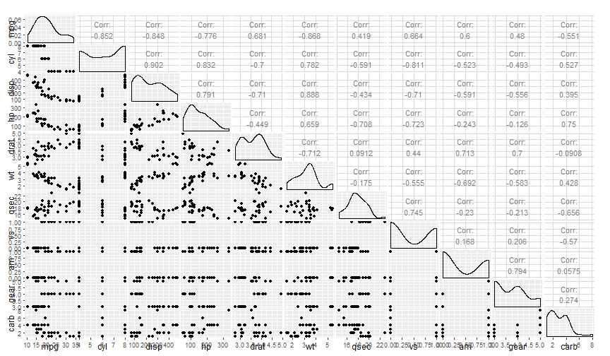

## Introduction

- This shiny app let's the user build a regression model for mpg usin the mtcars
dataset.

- You only have to select which regressors you wanna use and the app will return
the coefficients, $r^2$ values and a standardized residuals QQ plot.

---
## Pairs plot

This plot may help you select regressors.

---
## The app itself

- The app is available here: https://cparedes.shinyapps.io/shiny/

- This is how it looks:

---
## Interactive Plot

This rCharts plot shows the relationship between $mpg$ and $hp$, a regressor I 
suggest to include.

<iframe src=' assets/fig/plot-1.html ' scrolling='no' frameBorder='0' seamless class='rChart polycharts ' id=iframe- chart1ff0787d4e98 ></iframe> 
