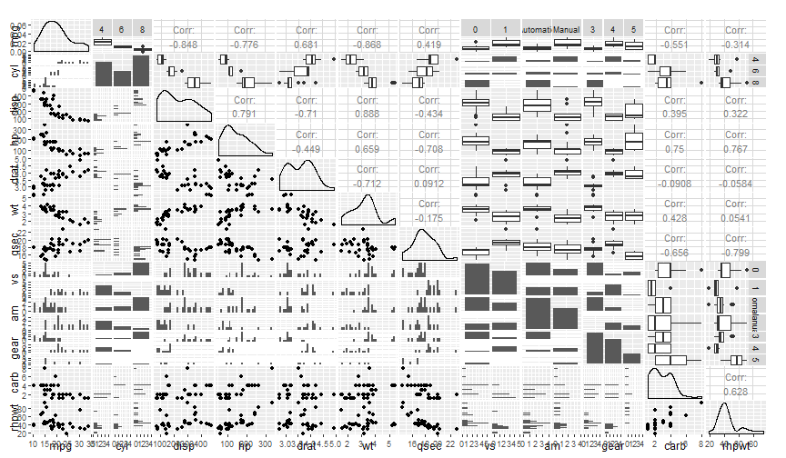

## Introduction

- This is a brief exploration of the mtcars dataset that comes with R.

- First, let's declare as factors those variables that are actually factors.


```r
mtcars$am <- factor(mtcars$am, labels = c('Automatic', 'Manual'))
mtcars$vs <- factor(mtcars$vs)
mtcars$gear <- factor(mtcars$gear)
mtcars$cyl <- factor(mtcars$cyl)
```

- Also, let's add a new field: $hp/mt$. This value was found by Henderson and 
Velleman (1981) to explain $mpg$. We'll do regression in a bit.


```r
mtcars$rhpwt <- mtcars$hp / mtcars$wt
```

---
## Pairs Plot

This plot shows the correlation between pairs of variables.



---
## Linear Regression Model

This command fits a linear regression model using $hp$, $rhpwt$ and $am$ as 
interacting regressors. Both $r^2$ and coefficients are shown below.


```r
fit <- lm(mpg ~ hp*rhpwt*am, mtcars)
```


```
## $r.squared
## [1] 0.9050797
## 
## $coefficients
##                        Estimate   Std. Error    t value     Pr(>|t|)
## (Intercept)       30.1797227127 5.0818758652  5.9386973 3.962412e-06
## hp                -0.1132832138 0.0291274100 -3.8892306 6.967811e-04
## rhpwt             -0.0211403656 0.1578945855 -0.1338891 8.946067e-01
## amManual          12.4463523839 6.4096112306  1.9418264 6.398516e-02
## hp:rhpwt           0.0008309843 0.0006894410  1.2053014 2.398370e-01
## hp:amManual       -0.1730764675 0.0548228190 -3.1570151 4.261076e-03
## rhpwt:amManual     0.0581582672 0.1757037872  0.3310018 7.435158e-01
## hp:rhpwt:amManual  0.0012427207 0.0008448366  1.4709598 1.542928e-01
```

---
## Interactive Plot

This rCharts plot shows the relationship between $mpg$ and $rhpwt$.

<iframe src=' figure/plot-1.html ' scrolling='no' frameBorder='0' seamless class='rChart polycharts ' id=iframe- chart5e417026cd1 ></iframe> <style>iframe.rChart{ width: 100%; height: 400px;}</style>
